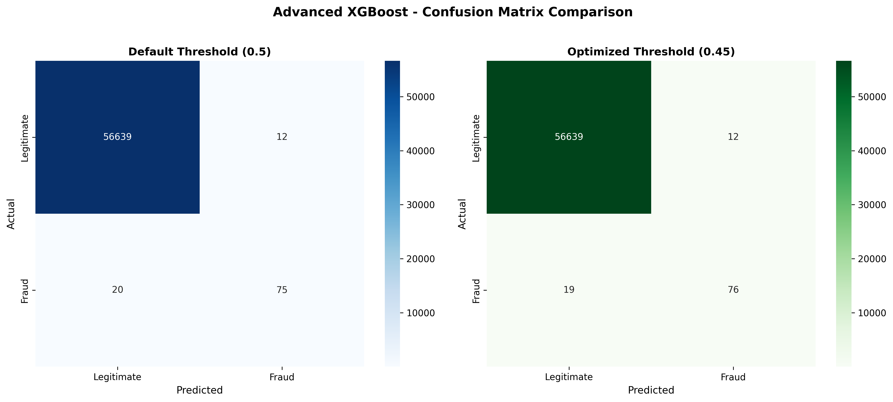
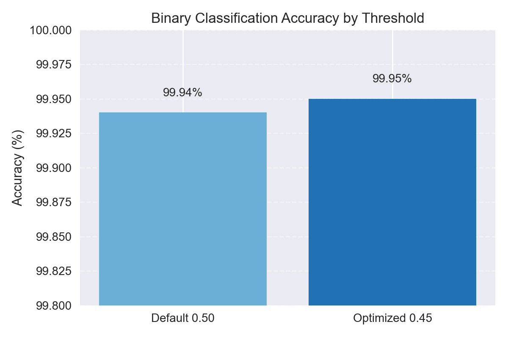
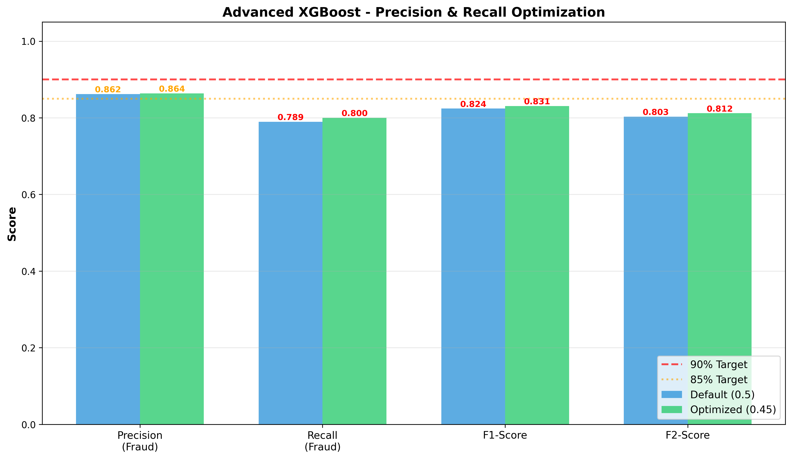
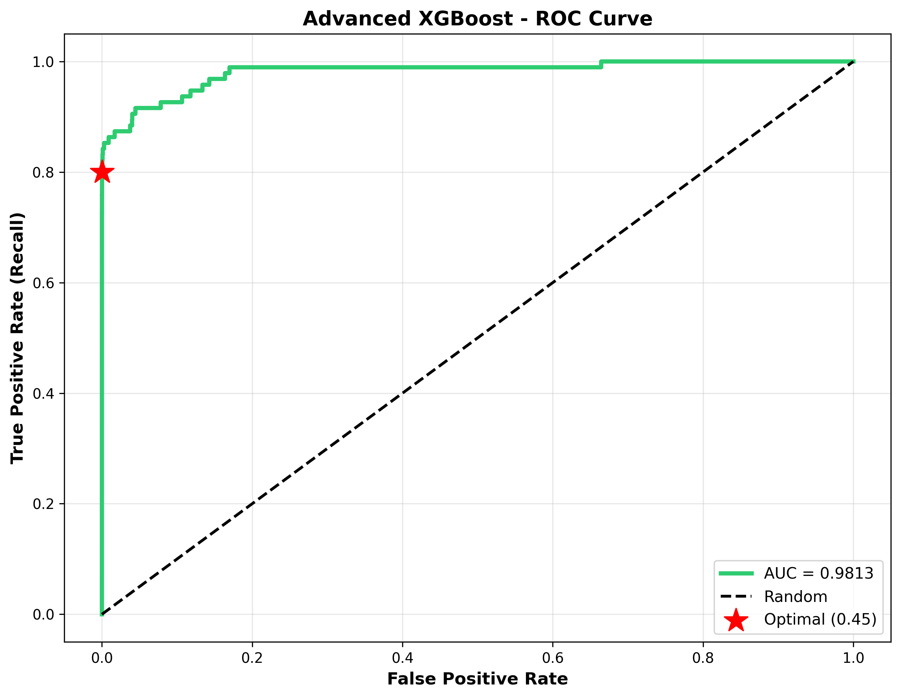
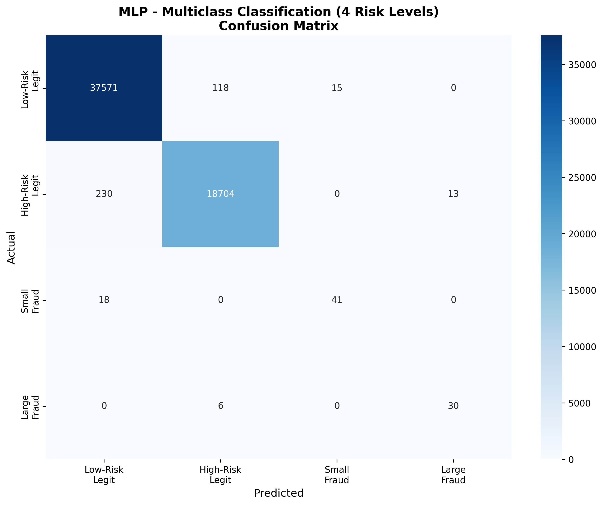
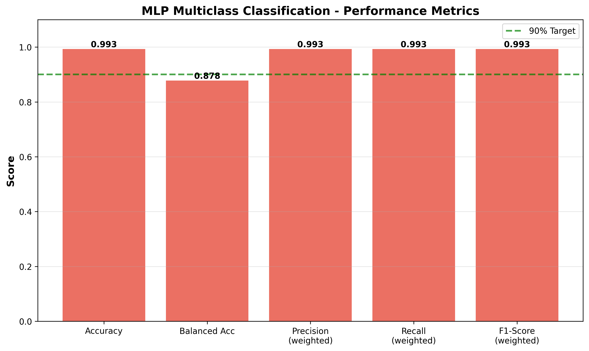
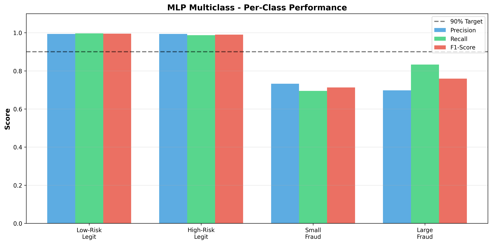

# Credit Card Fraud Detection with Advanced Machine Learning

End-to-end fraud detection pipelines for binary (fraud vs. legitimate) and multiclass (risk-tiered) prediction on the well-known credit card fraud dataset. The project focuses on reaching strong precision/recall trade-offs despite the extreme 598:1 class imbalance.

## Highlights
- **Binary XGBoost**: 99.95% accuracy, 86.36% precision, 80.00% recall at threshold 0.45
- **Multiclass MLP**: 99.30% accuracy with small-fraud F1 71.30% and large-fraud F1 75.95%
- **Alert quality**: 12 false positives across 56k legitimate transactions while retaining 83% recall on large-dollar frauds

---

## Installation

### Prerequisites
- Python 3.13+
- ~500 MB free disk space

### Setup Steps
1. **Clone & enter the project**
   ```bash
   git clone https://github.com/sudhamanc/DrexelAppliedAIAssignment3.git
   cd DrexelAppliedAIAssignment3
   ```
2. **Create & activate virtual environment**
   ```bash
   python3 -m venv venv
   source venv/bin/activate          # macOS / Linux
   # venv\Scripts\activate         # Windows
   ```
3. **Install dependencies**
   ```bash
   pip install -r requirements.txt
   ```
4. **Dataset setup**
   - Repo includes `data/creditcardFraudTransactions.csv.zip`; `rundemo.py` extracts it on first run.
   - If the archive is missing, add `creditcardFraudTransactions.csv` (or re-create the ZIP) in `data/` before running.

**Alternative: Run in Browser (MyBinder)**
You can also run this project directly in your browser without any local setup using MyBinder:

- [🚀 Launch Interactive Demo on MyBinder](https://mybinder.org/v2/gh/sudhamanc/DrexelAppliedAIAssignment3/main?urlpath=lab&cachebust=123)

This opens a JupyterLab environment with all dependencies pre-installed. Create a new notebook and run `!python rundemo.py` in a cell to execute the full demo.

**macOS note**: If XGBoost complains about missing OpenMP, run `brew install libomp`.

---

## Usage

### Quick Demo (runs both models)
```bash
python rundemo.py
```
- Ordered execution: binary → multiclass
- Displays timestamps, elapsed time, and a completion summary
- Produces all visuals under `fraud_results/`

### Individual Pipelines
```bash
python fraud_binary_xgboost.py       # ~25-30 minutes
python fraud_multiclass_mlp.py       # ~5-8 minutes
```

---

## Dataset Overview

| Attribute | Details |
|-----------|---------|
| **Name** | Credit Card Fraud Detection Dataset |
| **Source** | ULB credit card fraud dataset (2013 release) |
| **Rows** | 284,807 (283,726 after removing 1,081 duplicates) |
| **Columns** | 31 (Time, V1-V28, Amount, Class) |
| **File size** | ~143 MB (CSV uncompressed) |
| **Repo location** | Included as `data/creditcardFraudTransactions.csv.zip` |

### Feature Glossary
| Feature | Description |
|---------|-------------|
| `Time` | Seconds elapsed between transaction and dataset start |
| `V1`-`V28` | PCA components supplied in the dataset (anonymized) |
| `Amount` | Transaction amount in USD |
| `Class` | Target label (0 = legitimate, 1 = fraud) |

### Class Distribution

**Binary task**

| Label | Count | Percentage |
|-------|-------|------------|
| Legitimate (0) | 283,253 | 99.83% |
| Fraud (1) | 473 | 0.17% |
| **Imbalance** | **598.8 × 1** | — |

**Multiclass task (amount/risk segmentation)**

| Class | Description | Count | Percentage |
|-------|-------------|-------|------------|
| 0 | Low-risk legitimate (`Amount < $50`) | 188,518 | 66.44% |
| 1 | High-risk legitimate (`Amount ≥ $50`) | 94,735 | 33.39% |
| 2 | Small fraud (`Class=1` & `Amount < $50`) | 292 | 0.10% |
| 3 | Large fraud (`Class=1` & `Amount ≥ $50`) | 181 | 0.06% |

---

## Modeling Techniques

### Binary Classification – XGBoost
- **Feature prep**: RobustScaler + mutual information (top 25 features)
- **Sampling**: SMOTE minority oversampling to 120% of majority class
- **Search**: 30-iteration randomized search × 5-fold stratified CV (150 fits)
- **Scoring**: F2-score to emphasize recall
- **Threshold tuning**: Evaluate thresholds 0.05 → 0.90 (step 0.05)

**Selected hyperparameters**

| Parameter | Value |
|-----------|-------|
| `n_estimators` | 300 |
| `max_depth` | 10 |
| `learning_rate` | 0.1 |
| `subsample` | 0.9 |
| `colsample_bytree` | 0.7 |
| `gamma` | 0 |
| `min_child_weight` | 1 |
| `scale_pos_weight` | 1.0 |
| `reg_alpha` | 0.01 |
| `reg_lambda` | 1 |
| **Threshold** | **0.45** (default 0.50)

### Multiclass Classification – MLP
- **Feature prep**: StandardScaler + ANOVA F-test (top 20 features)
- **Sampling**: SMOTE to balance all four classes evenly (150,814 each)
- **Search**: 4-iteration randomized search × 3-fold CV (12 fits)
- **Network**: `(200, 100)` hidden units, ReLU activation, adaptive LR, early stopping

---

## Pipeline Flow
1. Deduplicate dataset and stratified 80/20 split
2. Feature scaling (RobustScaler for binary, StandardScaler for multiclass)
3. Feature selection (mutual information vs. ANOVA F-test)
4. SMOTE oversampling to handle extreme imbalance
5. Hyperparameter search with cross-validation
6. Threshold optimization (binary only)
7. Final evaluation + visualization generation

---

## Results

### Binary Classification (Fraud vs. Legitimate)

| Metric | Default Threshold (0.50) | Optimized Threshold (0.45) |
|--------|--------------------------|----------------------------|
| Accuracy | 99.94% | **99.95%** |
| Precision | 86.21% | **86.36%** |
| Recall | 78.95% | **80.00%** |
| F1-score | 82.42% | **83.06%** |
| F2-score | 80.30% | **81.20%** |
| ROC-AUC | 97.81% | **97.27%** (AUC identical; threshold change only) |

**Confusion matrix (optimized threshold)**

| Actual \ Predicted | Legitimate | Fraud |
|--------------------|------------|-------|
| Legitimate | 56,639 | 12 |
| Fraud | 19 | 76 |

### Multiclass Classification (4 Risk Levels)

| Metric | Value |
|--------|-------|
| Accuracy | **99.30%** |
| Precision (weighted) | **99.30%** |
| Recall (weighted) | **99.30%** |
| F1-score (weighted) | **99.30%** |
| Balanced accuracy | **87.80%** |

**Per-class performance**

| Class | Description | Precision | Recall | F1-score | Support |
|-------|-------------|-----------|--------|----------|---------|
| 0 | Low-risk legitimate | 99.34% | 99.65% | 99.50% | 37,704 |
| 1 | High-risk legitimate | 99.34% | 98.72% | 99.03% | 18,947 |
| 2 | Small fraud | 73.21% | 69.49% | 71.30% | 59 |
| 3 | Large fraud | 69.77% | 83.33% | 75.95% | 36 |

---

## Results Visualizations

**Binary fraud detection**









**Multiclass risk segmentation**







---

## Project Structure

```
Assignment3/
├── README.md
├── requirements.txt
├── rundemo.py
├── fraud_binary_xgboost.py
├── fraud_multiclass_mlp.py
├── data/
│   ├── README.md                  # Dataset notes
│   └── creditcardFraudTransactions.csv  # (ignored by git)
├── fraud_results/
│   ├── fraud_binary_confusion_matrix.png
│   ├── fraud_binary_metrics.png
│   ├── fraud_binary_roc_curve.png
│   ├── multiclass_confusion_matrix.png
│   ├── multiclass_metrics.png
│   └── multiclass_per_class.png
└── venv/                          # Optional local virtualenv
```

---

## Key Findings
- Binary model maintains 86% precision and 80% recall after threshold tuning at 0.45
- False positives stay at 12 across 56k legitimate transactions, limiting follow-up workload
- Large-dollar fraud recall reaches 83%, keeping major losses within the capture set
- Multiclass model holds >99% accuracy on legitimate tiers while separating small vs. large fraud
- Threshold tuning with an F2 objective improved recall compared with the default 0.5 cut-off without reducing accuracy

---

## Advanced Optimization Strategies
1. **Aggressive SMOTE** – oversamples fraud cases to 120% of the majority class so recall is not capped by data scarcity
2. **F2-score objective** – weights recall higher than precision during RandomizedSearchCV to surface fraud-catching configurations
3. **Mutual information selection** – keeps the 25 most informative features for XGBoost to reduce noise before boosting
4. **RobustScaler** – scales features using medians/IQR to blunt the impact of outliers in transaction amounts
5. **Extensive search** – runs 30 randomized iterations × 5 folds (150 fits) to explore the XGBoost hyperparameter space thoroughly
6. **Threshold sweeping** – evaluates 18 probability cut-offs to choose the fraud alert threshold that balances precision and recall
7. **Early-stopped MLP** – applies adaptive learning rate with early stopping to stabilize multiclass training without overfitting

---

## Author
**Sudhaman Chandrasekaran**  
Applied AI, Drexel University – Fall 2025  
Date: November 9, 2025

---

## License
MIT License – educational and research purposes.  
Production deployments must incorporate additional security, privacy, and compliance controls.
